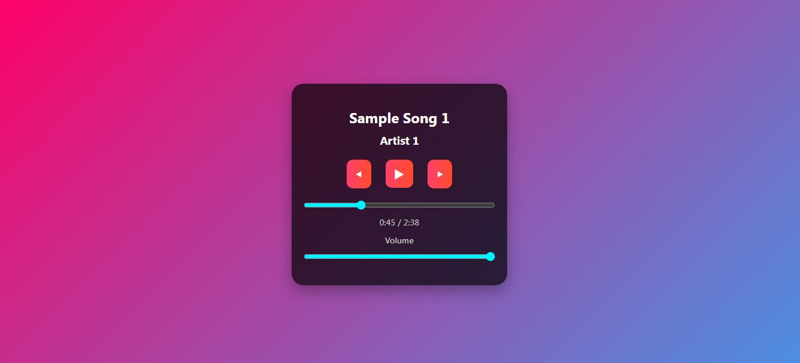

# CodeAlpha Music Player  

A sleek music player web app developed for **CodeAlpha Frontend Internship (Task 4)**.  

## Features  
- **Play/Pause**, **Next/Previous** track navigation  
- **Real-time progress bar** with seek functionality  
- **Volume control** slider  
- **Playlist system** with song metadata (title/artist)  
- **Responsive UI** with gradient background  

## Technologies  
- **HTML5** (Audio Element)  
- **CSS3** (Flexbox, Animations)  
- **JavaScript** (Audio API, DOM Manipulation)

## Screenshot  
 

## Project Structure  

- CodeAlpha_MusicPlayer
  
  - index.html → Player interface 
  - style.css → Styling and animations  
  - script.js → Audio control logic  
  - songs/ → Contains all the songs
